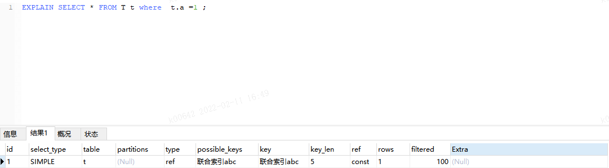

## 首先创建表 T

```sql
# 其中id为主键
# 联合索引abc为
CREATE TABLE `t` (
  `id` bigint NOT NULL AUTO_INCREMENT,
  `a` int DEFAULT NULL,
  `b` int DEFAULT NULL,
  `c` int DEFAULT NULL,
  `d` int DEFAULT NULL,
  PRIMARY KEY (`id`),
  KEY `a` (`a`,`b`,`c`) USING BTREE
) ENGINE=InnoDB AUTO_INCREMENT=4 DEFAULT CHARSET=utf8mb4 COLLATE=utf8mb4_0900_ai_ci;
```

## 进行如下测试：

- ```sql
  EXPLAIN SELECT * FROM T t where  t.a =1;
  # 可以走联合索引abc
  ```

  

- ```sql
  EXPLAIN SELECT * FROM T t where  t.a =1 and t.b=1 ;
  # 可以走联合索引abc
  ```

  

- ```sql
  EXPLAIN SELECT * FROM T t where  t.b =1 and t.c=1 ;
  # 不可以走联合索引abc
  ```

  

- ```sql
  EXPLAIN SELECT * FROM T t where  t.a =1 and t.c=1 ;
  # 可以走联合索引abc
  ```

  

- ```sql
  EXPLAIN SELECT * FROM T t where  t.c=1 ;
  # 不可以走联合索引abc
  ```

  

- ```sql
  EXPLAIN SELECT a,b,c FROM T t where  t.b =1 and t.c=1 ;
  EXPLAIN SELECT b,c FROM T t where  t.b =1 and t.c=1 ;
  # 可以走联合索引abc 【其实还是进行了全表扫描】
  ```

  

- ```sql
  EXPLAIN SELECT a,b,c FROM T t where  t.c=1 ;
  EXPLAIN SELECT b,c FROM T t where  t.c=1 ;
  EXPLAIN SELECT c FROM T t where  t.c=1 ;
  # 可以走联合索引abc 【其实还是进行了全表扫描】
  ```

  

