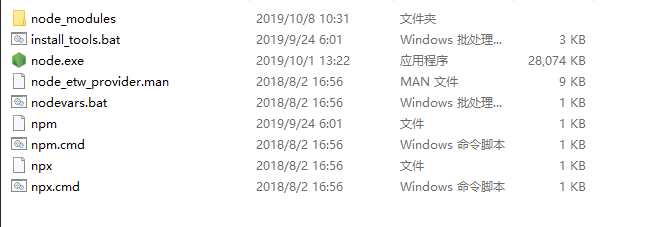
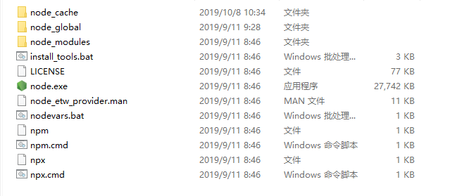
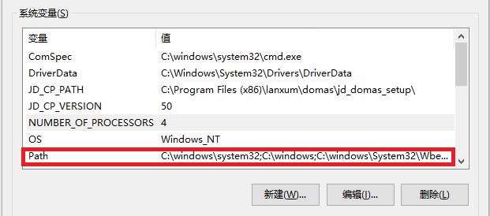
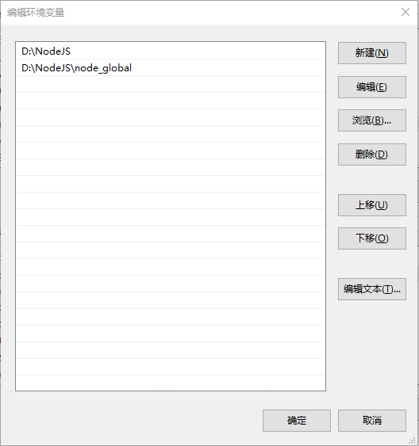

[TOC]


## Windows 安装


### 下载nodejs

**下载稳定版的nodejs ( 下面是我写此文档时使用的nodejs版本,直接复制链接到浏览器地址栏即可下载 )**

```shell
https://npm.taobao.org/mirrors/node/v12.11.1/node-v12.11.1-x64.msi 
```


### 安装nodejs 

#### 将node-v12.11.1-x64.msi 安装到你自己喜欢的路径

```shell
我安装到了 D:\nodejs 目录下
进入到 D:\nodejs 目录下
```



#### 新建 node_global ,node_cache 两个文件夹




### 配置环境变量

#### 打开系统变量配置



#### 编辑Path,新增两条信息

- D:\nodejs
- D:\nodejs\node_global




### 配置 npm 为淘宝镜像

#### 打开cmd 输入以下内容

```shell
npm config set registry https://registry.npm.taobao.org
```


### 配置 npm 包和缓存的路径

#### 打开cmd ,依次输入以下内容

```
npm config set prefix "D:\nodejs\node_global"
npm config set cache  "D:\nodejs\node_cache"
```


## Ubuntu 安装


### 下载nodejs

**下载稳定版的nodejs ( 下面是我写此文档时使用的nodejs版本,直接复制链接到浏览器地址栏即可下载 )**

```shell
wget https://npm.taobao.org/mirrors/node/v12.12.0/node-v12.12.0-linux-x64.tar.xz
```


### 解压nodejs

```shell
tar -xvf node-v12.12.0-linux-x64.tar.xz -C /usr/local
```


### 重命名

```shell
mv /usr/local/node-v12.12.0-linux-x64 /usr/local/nodejs
```


### 配置环境变量


#### 编辑 /etc/profile文件

```shell
vi /etc/profile
```


#### 在 /etc/profile 文件末尾新加

```shell
export NODE_HOME=/usr/local/nodejs
export PATH=$PATH:$NODE_HOME/bin
export PATH=$PATH:$NODE_HOME/node_global/bin
```


### 配置 npm 为淘宝镜像

#### 打开cmd 输入以下内容

```shell
npm config set registry https://registry.npm.taobao.org
```


### 配置 npm 包和缓存的路径

#### 打开cmd ,依次输入以下内容

```
npm config set prefix "D:\nodejs\node_global"
npm config set cache  "D:\nodejs\node_cache"
```