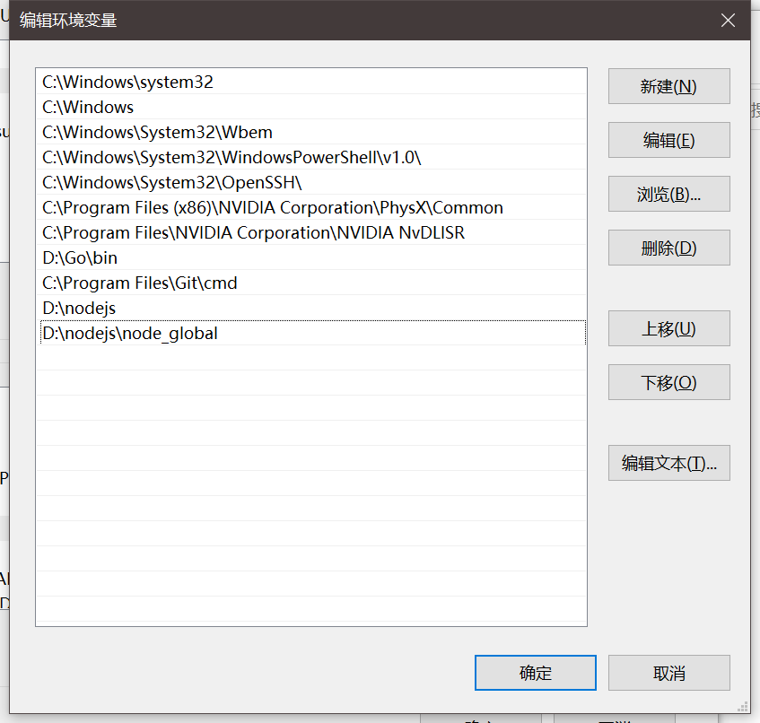

## Windows 安装

**下载稳定版的NodeJS ( 下面是我写此文档时使用的NodeJS版本,直接复制链接到浏览器地址栏即可下载 )**

```shell
https://npm.taobao.org/mirrors/node/v12.11.1/node-v12.11.1-x64.msi 
```

### 安装NodeJS 

#### 将node-v12.11.1-x64.msi 安装到你自己喜欢的路径

```shell
我安装到了 D:\NodeJS 目录下
进入到 D:\NodeJS 目录下
```


#### 新建 node_global ,node_cache 两个文件夹


### 配置环境变量

#### 打开系统变量配置


#### 编辑Path,新增两条信息

- D:\NodeJS
- D:\NodeJS\node_global




### 配置 npm 为淘宝镜像

#### 打开cmd 输入以下内容

```shell
npm config set registry https://registry.npm.taobao.org
```


### 配置 npm 包和缓存的路径

#### 打开cmd ,依次输入以下内容

```
npm config set prefix "D:\NodeJS\node_global"
npm config set cache  "D:\NodeJS\node_cache"
```


