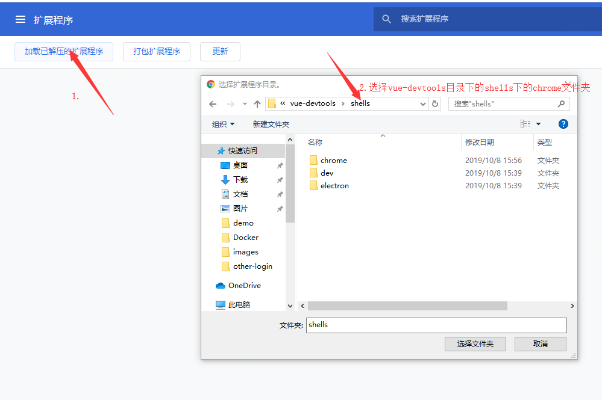

[TOC]


## Windows安装

### 克隆vue-devtools

```shell
# 打开 cmd 输入 ( 一般情况下在C盘用户主目录下 )
git clone https://github.com/vuejs/vue-devtools.git
```

### 进入 vue-devtools

```shell
# cmd窗口中输入
cd vue-devtools
```

### 安装vue-devtools所需的插件(此处需要安装NodeJS)

```shell
# cmd 窗口中依次输入以下命令
npm install
npm run build
```

### 在Chrome浏览器加入vue-devtools插件

#### 进入Chrome浏览器扩展程序界面

```shell
# 在Chrome浏览器地址栏输入: 
chrome://extensions/
```

#### 将右上角设置为开发者模式


#### 添加vue-devtools到Chrome浏览器




## Windows快速使用

```shell
# 将此文件的同级目录下的chrome复制到任意路径
# 然后在Chrome浏览器扩展程序中通过 *加载已解压的扩展程序* 添加它
```

